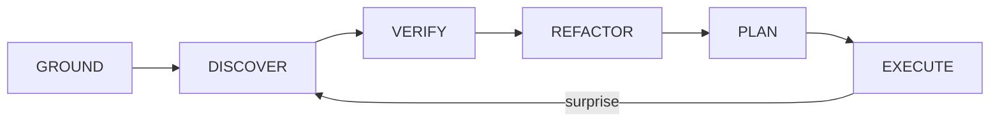

# Rebuild Schema harness (clean-room, for ARC-AGI-3)

A clean-room reproduction of the **conceptual agentic structure** of the *Schema*
harness by **Impossible Research** (Guanning Zeng, Andrea Zanette) for
[ARC-AGI-3](https://arcprize.org/). It reconstructs the *design* from public
sources — it copies no original prompts, weights, or traces. The goal is a
faithful, runnable skeleton of the harness's control flow (author a world model,
verify it, plan inside it, act), a clean model-provider abstraction in place of
the proprietary stack, and a scoring pipeline that **recomputes RHAE** from the
published trace format so the structure can be validated against the real
dataset. Primary sources: the paper
[*Executable World Models for ARC-AGI-3 in the Era of Coding Agents*](https://arxiv.org/abs/2605.05138)
(arXiv 2605.05138), [schema-harness.github.io](https://schema-harness.github.io),
and the HF dataset
[schema-harness/arc-agi-3-schema-traces](https://huggingface.co/datasets/schema-harness/arc-agi-3-schema-traces).

## What is and isn't reproduced

> **Honesty banner.** This repo reproduces the harness *design*, not the original
> system. Where a detail is not public, it is reconstructed and labelled as such —
> in the code, in the configs, and in [`docs/REPRODUCTION_PLAN.md`](docs/REPRODUCTION_PLAN.md).

**Reproduced here (structure + validation):**
- the scripted, game-agnostic **controller loop** and its phase cycle
  (`schema_repro/controller.py`);
- the **world-model / verifier / planner / provider interfaces**
  (`schema_repro/world_model.py`, `verifier.py`, `planner.py`, `providers/`);
- a **sandbox** that runs the agent-authored program under an import allowlist
  (`schema_repro/sandbox.py`);
- **RHAE scoring** that streams `events.jsonl` and recomputes every score
  (`schema_repro/scoring/rhae.py`);
- an **offline end-to-end demo** on a toy game, using a deterministic fake
  provider — no network, no API key (`scripts/run_offline_demo.py`).

**Not byte-reproducible** (documented per item in
[`docs/REPRODUCTION_PLAN.md`](docs/REPRODUCTION_PLAN.md) as known / inferred /
approximated / validated):
1. the concrete **system prompts and agent configurations** (described, not
   released — "project code released after acceptance");
2. exact **model and API versions** (frontier, proprietary, subject to drift and
   deprecation);
3. the **Fable-5 fallback logic** (a provider-internal, server-side refusal
   fallback — see [`docs/MODEL_AND_FALLBACK.md`](docs/MODEL_AND_FALLBACK.md));
4. the exact **sandbox, time, token, and tool limits** (shape described, numbers
   not — see [`docs/SANDBOX_AND_BUDGETS.md`](docs/SANDBOX_AND_BUDGETS.md));
5. any **internal Impossible Research eval infrastructure**;
6. the same **non-deterministic model responses** (impossible by nature —
   sampling).

This repo makes **no ARC-AGI-3 score claim**. Schema's self-reported results are
~99% RHAE (98.98%) with Claude Opus 4.8 + Fable 5 and 95.35% with GPT-5.6 Sol on
the Public set; those are the *original* numbers, not this reproduction's. The
RHAE figures printed from `fixtures/` are **illustrative synthetic data**, not a
measurement of anything.

## The core idea

- **Play each game "like a physicist."** A frontier LLM is dropped into a novel
  ARC-AGI-3 game with no rules, goal, or object list, and reverse-engineers its
  mechanics from observation.
- **One small, continually edited Python program *is* the world model.** State
  grounding and mechanism discovery are solved *jointly* in a single editable
  program; refactoring it toward simpler abstractions is a practical proxy for an
  MDL-like simplicity bias.
- **Ground + discover.** The program turns the raw 64x64 grid of 16 colour
  indices into objects/variables/relations (grounding) and encodes how state
  changes under an action as executable rules (discovery).
- **Verify before trusting.** Formal verifiers gate every revision: a world-model
  verifier requires the program to *reproduce recorded observations*, and a
  planner verifier requires a plan that reaches completion *inside the learned
  model*. Only then are live actions committed.
- **Plan inside the model, then act.** Search runs against the learned program;
  a "surprise" (a live frame disagreeing with the prediction) sends control back
  to discovery. The **same agent and prompts are used across all games** — no
  per-game code, prompts, or heuristics.

Controller phase cycle (`schema_repro/types.py::Phase`, driven by
`schema_repro/controller.py`):



## Repo layout

| Path | What it is |
| --- | --- |
| `configs/default.yaml` | Sandbox / time / token / tool limits + per-level budgets (reconstructed). |
| `configs/models.yaml` | Model chain, fallback policy, and `effort_by_phase`. |
| `schema_repro/types.py` | `GameState`, `Action`, `Frame`, `Phase`, `Effort`, `StepResult`. |
| `schema_repro/config.py` | Loads the two YAML configs into typed objects. |
| `schema_repro/world_model.py` | `WorldModel` protocol + `EditableProgram` + `Transition`. |
| `schema_repro/controller.py` | The scripted, game-agnostic control loop (phase cycle). |
| `schema_repro/sandbox.py` | Loads the agent program under an import allowlist; injects `Action`/`Frame`. |
| `schema_repro/verifier.py` | `SchemaVerifier`: `check_world_model` + `check_planner`. |
| `schema_repro/planner.py` | `BFSPlanner`: search inside the world model. |
| `schema_repro/agent.py` | `LLMAgent`: authors/edits the program; explores. |
| `schema_repro/prompts/` | The two reconstructed, game-agnostic role prompts `LLMAgent` loads. |
| `schema_repro/tracing.py` | `Event`, `TraceWriter`, `read_events`, `action_counts_by_level`. |
| `schema_repro/scoring/rhae.py` | `LevelScore`, `RhaeReport`, `load_baselines`, `score_events`, `recompute_from_traces`. |
| `schema_repro/providers/base.py` | `Provider` protocol, `ModelRequest`/`Response`, `FallbackProvider`. |
| `schema_repro/providers/fake.py` | `FakeProvider` (offline, deterministic) + `RefusingProvider`. |
| `schema_repro/providers/anthropic_provider.py` | Opus 4.8 + Fable 5 (adaptive thinking, effort, server-side fallback). |
| `schema_repro/providers/openai_provider.py` | GPT-5.6 Sol. |
| `schema_repro/providers/registry.py` | `build_provider(profile) -> Provider`. |
| `schema_repro/env/simulated.py` | `GridPursuit` toy game (offline demo/tests). |
| `schema_repro/env/replay.py` | `ReplayEnv` over a recorded `events.jsonl`. |
| `schema_repro/env/arc_agi3.py` | Live ARC-AGI-3 adapter (best-effort, lazy SDK). |
| `fixtures/example_world_model.py` | Example agent-authored program (GridPursuit). |
| `fixtures/traces/` | Synthetic, dataset-shaped traces + `baseline_actions.csv`. |
| `scripts/make_fixtures.py` | Generates the synthetic traces. |
| `scripts/recompute_rhae.py` | CLI: recompute RHAE from a traces dir (per collection). |
| `scripts/run_offline_demo.py` | Runs the full loop offline, writes a trace. |
| `tests/` | 13 tests: RHAE math, verifier/planner, fallback, e2e, sandbox, trace. |

## Quickstart

```bash
pip install -e .[dev]                          # core + pytest; no API key needed
python scripts/run_offline_demo.py             # full loop on the toy game, offline
python scripts/recompute_rhae.py fixtures/traces
pytest -q                                      # 13 tests
```

The offline demo runs the real controller (grounding, verification, planning,
execution, tracing) against a deterministic `FakeProvider`, and prints:

```
game=grid_pursuit solved=True actions=9 model_edits=1
```

`recompute_rhae.py` streams each collection's `events.jsonl`, reconstructs
per-level action counts, joins `baseline_actions.csv`, and prints a per-level
table plus a per-collection RHAE summary. The numbers from `fixtures/` are
illustrative synthetic data. (RHAE — Relative Human Action Efficiency — compares
an agent's per-level action count against a first-exposure human baseline;
100% = completing every level at or above the human baseline.)

Live evaluation is optional and pulls extra dependencies:
`pip install -e .[anthropic]`, `.[openai]`, or `.[arc]`. Model IDs are read from
env vars (see `configs/models.yaml`); they are deliberately not pinned to dated
snapshots.

## Docs

- [`docs/ARCHITECTURE.md`](docs/ARCHITECTURE.md) — the reconstructed agentic
  structure, mapped 1:1 onto the `schema_repro/` modules.
- [`docs/REPRODUCTION_PLAN.md`](docs/REPRODUCTION_PLAN.md) — the known / inferred /
  approximated / validated split, item by item (the six non-reproducible things).
- [`docs/MODEL_AND_FALLBACK.md`](docs/MODEL_AND_FALLBACK.md) — model chain,
  per-phase effort, and the provider-internal Fable-5 refusal fallback.
- [`docs/SANDBOX_AND_BUDGETS.md`](docs/SANDBOX_AND_BUDGETS.md) — sandbox model and
  the reconstructed time / token / tool budgets.
- [`docs/TRACE_FORMAT.md`](docs/TRACE_FORMAT.md) — the reconstructed,
  RHAE-compatible `events.jsonl` schema (exact original field names are not
  public).
- [`docs/EVALUATION.md`](docs/EVALUATION.md) — the ARC-AGI-3 POMDP environment and
  the RHAE metric / recompute pipeline.
- [`docs/SOURCES.md`](docs/SOURCES.md) — the annotated public-source bibliography.

## Sources

- https://arxiv.org/abs/2605.05138
- https://schema-harness.github.io
- https://huggingface.co/datasets/schema-harness/arc-agi-3-schema-traces
- https://arcprize.org/
