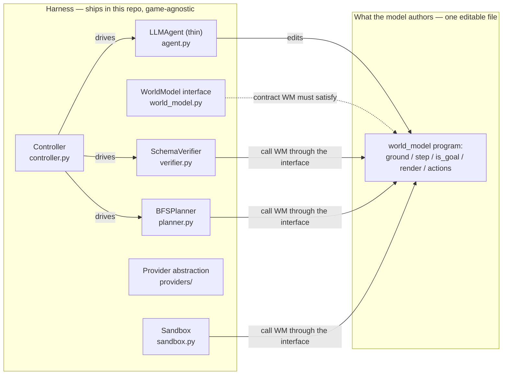
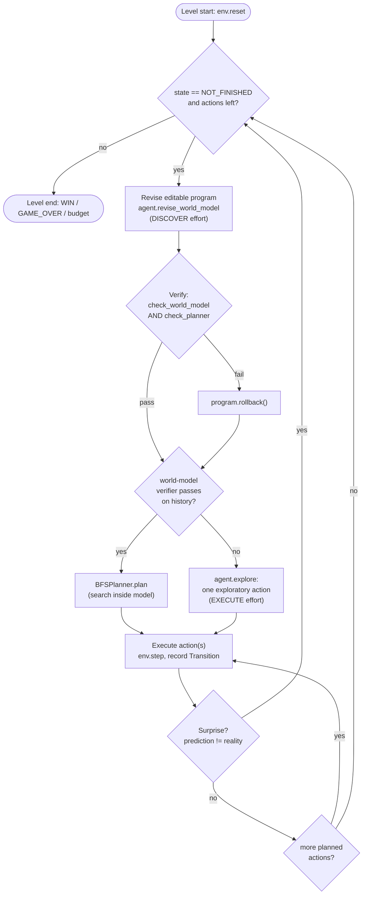

# Architecture

This document describes the reconstructed agentic structure of the **Schema**
harness (Impossible Research, for ARC-AGI-3) as it is realized in this repo. It
maps the design 1:1 onto the modules under `schema_repro/`.

Schema's structure is reconstructed from public sources (the project page, the
arXiv report, the ARC-AGI-3 technical report, the HF dataset card, and the
authors' announcement). The **conceptual structure** described here is faithful
to those sources. The **exact prompts, model/API versions, provider-internal
fallback, and resource limits are not public** — where this repo fills a gap it
says so, and `docs/REPRODUCTION_PLAN.md` tracks each gap as
known / inferred / approximated / validated. Nothing here is copied from the
original, unreleased implementation.

> This repo reproduces the *structure* and *validates the scoring* (by
> recomputing RHAE from traces). It runs a toy game offline. It does **not**
> claim any ARC-AGI-3 score. The headline results it references —
> ~99% RHAE (self-reported 98.98%) with Opus 4.8 + Fable 5, and 95.35% with
> GPT-5.6 Sol — are Schema's, not this reproduction's.

---

## 1. The core idea

Schema does not ask the model to *play* the game. It asks the model to act
"like a physicist": to **write and continually edit one small Python program
that IS the game's mechanism**, verify that program against recorded history,
and **plan inside it via search** before committing any action to the live game.

That single editable program jointly solves two formal sub-problems (see the
module docstring in `schema_repro/world_model.py`):

1. **State grounding** — turn a raw 64x64 grid of 16 colour indices into
   objects, variables, and relations that can be tracked (`ground`).
2. **Mechanism discovery** — express how that state changes under each action as
   an executable rule (`step`), plus a goal predicate (`is_goal`), a projection
   back to pixels (`render`), and the legal-action set (`actions`).

The harness itself contains **no game-specific code, prompts, heuristics, or
hidden solutions**. It ships a scripted controller, the world-model interface,
two verifiers, an in-model planner, a sandbox, and a model-provider abstraction.
The *same* agent and prompts are used across every game. All game understanding
lives in the program the model writes.

### What ships vs. what the model writes



The dividing line is strict: the harness only ever touches the program **through
the five interface functions**. It never inspects the program's internal state
representation (`State` is an opaque, JSON-serialisable object owned by the
program — see `world_model.py`), which is precisely what keeps the harness
game-agnostic.

---

## 2. Component / responsibility table

| Component | Module | Ships in harness? | Responsibility |
|---|---|---|---|
| Controller | `schema_repro/controller.py` | Yes | The scripted, game-agnostic loop. Runs the phase cycle per level, assigns per-phase effort, gates revisions on verification, runs the surprise → re-discover loop. Contains no game logic. |
| WorldModel interface | `schema_repro/world_model.py` | Yes (interface only) | The `Protocol` the agent-authored program must satisfy: `ground / step / is_goal / render / actions`. Also `EditableProgram` (version-tracked source + rollback) and `Transition`. |
| World-model program | authored by the model at runtime | **No — model writes it** | The actual grounding + mechanism + goal. Loaded from disk; the only place game knowledge exists. (`fixtures/example_world_model.py` is a sample for the toy game.) |
| SchemaVerifier | `schema_repro/verifier.py` | Yes | Two gates: `check_world_model` (replay recorded transitions) and `check_planner` (bounded reachability inside the model). No game logic — operates purely through the interface. |
| BFSPlanner | `schema_repro/planner.py` | Yes | Breadth-first search over `actions`/`step`/`is_goal` inside the verified model to produce a shortest action sequence to a goal. |
| LLMAgent | `schema_repro/agent.py` | Yes (thin) | Turns history into a prompt, asks the provider to edit the program (or to propose one exploratory action), parses the reply. Same prompts across all games. |
| Sandbox | `schema_repro/sandbox.py` | Yes | Loads the untrusted program with an import allowlist, injects `Action`/`Frame`, exposes it as a `WorldModel`. Isolation boundary. |
| Provider abstraction | `schema_repro/providers/` | Yes | `Provider` protocol + `ModelRequest`/`ModelResponse`, a transparent `FallbackProvider`, and Anthropic/OpenAI/fake backends. Model-agnostic access. |
| Types | `schema_repro/types.py` | Yes | `GameState`, `Action`, `Frame`, `Phase`, `Effort`, `StepResult`, action constants. |
| Config | `schema_repro/config.py` | Yes | Loads `configs/default.yaml` + `configs/models.yaml` into `RunConfig` (sandbox, `Budgets`, `effort_by_phase`, model profile). |
| Tracing | `schema_repro/tracing.py` | Yes | `Event` / `TraceWriter` / `read_events` — a dataset-compatible `events.jsonl` stream for replay and RHAE recomputation. |

---

## 3. The controller and its phase cycle

`schema_repro/controller.py` is the harness proper: a fixed loop that coordinates
four injected collaborators — an `Environment` (live ARC-AGI-3 or a trace
replay), the `Agent`, the `Verifier`, and the `Planner` — plus a `Provider` and a
`RunConfig`. All four are declared as `Protocol`s at the top of the module, so
the controller depends on shapes, not concrete classes.

### Conceptual phases vs. the runtime loop

`schema_repro/types.py` enumerates the full conceptual cycle as `Phase`:

```
GROUND -> DISCOVER -> VERIFY -> REFACTOR -> PLAN -> EXECUTE
```

The `Phase` enum exists primarily so that **reasoning effort can be assigned per
phase** (Section 9). The runtime loop in `Controller.run_level` realizes those
phases as a tighter sequence — this is an honest reconstruction detail, not a
claim about Schema's internal call graph:

- **GROUND + DISCOVER + REFACTOR** collapse into a single call to
  `agent.revise_world_model(...)` at `DISCOVER` effort. Grounding lives inside
  the program's own `ground`; the "refactor toward simpler abstractions"
  (an MDL-like simplicity bias) is requested in the agent's prompt
  ("Prefer the simplest program that fits all observations"), not as a separate
  controller step.
- **VERIFY** is an inline gate: immediately after each edit, *both* verifiers
  must pass or the program is rolled back to the last good revision.
- **PLAN** runs the planner, but only if the world-model verifier currently
  passes on the accumulated history.
- **EXECUTE** commits actions one at a time, checking for a *surprise* after
  each and abandoning the rest of the plan if reality diverges.

### The loop, as implemented

Per level (`run_level`), with budgets `b = self.cfg.budgets`:

1. `env.reset(game_id)` → first `Frame`; emit `level_start`.
2. While the game is `NOT_FINISHED` and `actions_used < b.max_live_actions_per_level`:
   - **Revise** (once enough history exists and edit budget remains): call
     `revise_world_model`, increment the edit count, emit `model_edit` with the
     new `revision_id()`.
   - **Verify**: `check_world_model AND check_planner`; emit `verify`; on failure
     call `program.rollback()`.
   - **Plan**: if `check_world_model` passes, `planner.plan(...)[: b.max_plan_depth]`;
     emit `plan`. Otherwise the plan is empty.
   - **Choose actions**: the plan if non-empty, else a single `agent.explore(...)`
     action (at `EXECUTE` effort).
   - **Execute**: for each action, `env.step`, append a `Transition`, emit
     `action` + `observation`; break on terminal state / budget exhaustion; and
     break on a **surprise**.
3. `solved = frame.state == WIN`; emit `level_end`; return a `LevelOutcome`
   (`game_id, level, solved, action_count, model_edits`).

### The surprise → re-discover loop

`_surprised(program, prev, action, obs)` returns `True` when the model's
prediction for a single just-taken step disagrees with reality. It is
implemented by delegating to the verifier's replay check over a one-item history
(`check_world_model(program, [Transition(prev, action, obs)])`). When a surprise
fires, the controller breaks out of the plan and loops back to the top, where the
next iteration re-revises the program against the now-larger history. This is the
mechanism that keeps the world model honest: **the model is only trusted after
its predictions have been checked against real observations.**



---

## 4. The single editable world-model program

The heart of Schema is one small Python program, authored and continually edited
by the model. `schema_repro/world_model.py` defines the *interface* it must
satisfy and a thin handle around it — never the program's contents.

### The `WorldModel` protocol

Every agent-authored program must expose these five callables at module scope
(`WorldModel`, a `@runtime_checkable` `Protocol`):

| Function | Signature | Role |
|---|---|---|
| `ground` | `ground(frame: Frame) -> State` | Parse a raw frame into structured state (objects / variables / relations). |
| `step` | `step(state: State, action: Action) -> State` | Predict the next state after an action — the discovered mechanism. |
| `is_goal` | `is_goal(state: State) -> bool` | Whether a state satisfies the inferred success condition. |
| `render` | `render(state: State) -> Grid` | Project state back to a grid, so predictions can be checked pixel-wise. |
| `actions` | `actions(state: State) -> list[Action]` | Legal actions the planner may consider from a state. |

`State` is `Any` — an opaque, JSON-serialisable object the program owns. The
harness only round-trips it through these functions.

### `EditableProgram` — version-tracked source

`EditableProgram` is a dataclass handle to the program's `source` plus its full
`revisions` history. It is deliberately **side-effect free** (no disk I/O — the
sandbox handles loading), which keeps it trivially unit-testable:

- `revision_id()` — a short SHA-256 of the current source, used in trace events.
- `edit(new_source)` — push the old source onto `revisions`, set the new one,
  return the new id.
- `rollback()` — pop the last revision back into `source`. This is what the
  controller calls when verification fails.

### `Transition`

A recorded `(frame, action, next_frame)` triple. The world-model verifier
replays these (Section 5).

---

## 5. The two verifiers, and why they gate every revision

`schema_repro/verifier.py` implements `SchemaVerifier` with two checks that
mirror Schema's described workspace. Neither contains game-specific logic; both
operate purely through the program's own interface (loaded via the sandbox).

**`check_world_model(program, history)` — the world-model verifier (replay).**
For each recorded `Transition`, it requires
`render(step(ground(frame), action))` to equal the observed `next_frame.grid`,
compared with `_grids_equal`. Any empty program, sandbox load failure, or
exception thrown by the program is treated as a verification **failure** (returns
`False`). This is the formal statement of "the program must *reproduce recorded
observations*."

**`check_planner(program, frame)` — the planner verifier (reachability).**
A bounded depth-first search from `ground(frame)` over the program's own
`actions`/`step`/`is_goal`, capped at `plan_node_cap` (default 20,000 nodes) and
`plan_depth_cap` (default 64). It returns `True` only if some goal state is
reachable *inside the learned model* — i.e. the planner *can* produce a completing
plan. Whether that plan works in the real game is decided later, by execution and
the surprise check.

**Why gate.** In the controller, a revision is committed only if *both* verifiers
pass; otherwise it is rolled back. This enforces the invariant that further live
actions are taken only against a model that (a) reproduces everything seen so far
and (b) admits a path to the goal. Planning on an unverified model would be
planning on a fiction. The surprise check (Section 3) reuses `check_world_model`
on a one-item history, so the same replay gate that admits a revision also
detects when reality later contradicts it.

---

## 6. The in-model planner

`schema_repro/planner.py` implements `BFSPlanner`. It grounds the current frame,
then runs breadth-first search over the program's `actions`/`step`/`is_goal` to
return the **shortest** action sequence reaching a goal state, bounded by
`max_depth` (default 64) and `max_nodes` (default 200,000). BFS is chosen because
its shortest-path property aligns with RHAE's preference for fewer actions
(actions are the efficiency axis / tiebreaker of the metric). States are
deduplicated via `_key` (imported from `verifier.py`), which falls back to
`repr(state)` for unhashable states. Any program crash yields an empty plan
(`return []`), which the controller reads as "cannot plan — explore instead."

Planning happens **through** the world model, never over raw grids — the planner
only ever sees model states. Because the model is trusted only after the
verifiers pass, planning on it is meaningful.

---

## 7. The thin LLM agent

`schema_repro/agent.py` (`LLMAgent`) is deliberately minimal. It does not "play";
it does two things, both routed through a `Provider`:

- **`revise_world_model(program, history, provider, effort)`** — builds a prompt
  from the current program source plus the last 16 transitions
  (`_history_prompt`), asks the provider to return a full program in one
  ` ```python ` block, extracts it with `_CODE_BLOCK`, and applies it via
  `program.edit(...)`.
- **`explore(frame, history, provider, effort)`** — used when the model is still
  too weak to plan. It asks for a single action token, parsed by `_parse_action`
  (`_ACTION_RE`), with `ACTION6` carrying `x`/`y`. Parsing falls back to the
  first legal simple action, else `ACTION1`, so exploration is always
  well-formed and legal.

**Same prompts across games.** The system prompts are loaded from
`schema_repro/prompts/` if present (`world_model_engineer.md`, `explorer.md`),
otherwise from in-module fallbacks (`_FALLBACK_SYSTEM`, `_FALLBACK_EXPLORE`).
They contain **no game-specific content**, matching Schema's "same agent and
prompts across games." The concrete prompt text Impossible Research used is not
public; the prompts here are reconstructions (see `docs/REPRODUCTION_PLAN.md`).

The agent works with *any* `Provider` — the offline `FakeProvider` for tests and
trace replay, or a real frontier provider for live runs — so the harness never
hard-depends on a vendor.

---

## 8. The sandbox boundary

The agent-authored program is untrusted code. `schema_repro/sandbox.py` loads it,
exposes its functions as a `LoadedModel` (which conforms to `WorldModel`), and
must not let the program stall the run or reach the network.

- **`load(program, sandbox)`** compiles `program.source` and `exec`s it into a
  fresh namespace. This `exec` is the deliberate sandbox boundary.
- **Import allowlist.** The namespace's `__import__` is replaced by
  `_guarded_import(allowed)`, which raises `SandboxError` for any root module not
  in `sandbox.allowed_imports`. The allowlist is enforced in both backends so
  tests exercise the restriction.
- **Injected contract.** `Action` and `Frame` are injected into the namespace so
  the untrusted program can emit real actions and read frames **without importing
  (and thus reaching into) the harness package**.
- **Missing functions** surface as `SandboxError` (`LoadedModel._fn`), which the
  verifier/planner treat as failure rather than crash.

Two backends are described: `none` (in-process `exec`, used by tests) and
`subprocess` (re-exec in a child with CPU/memory/wall-clock rlimits and no
inherited file descriptors). **Only the *shape* of isolation is reconstructed.**
The current `load` routes both modes through the same in-process loader with the
allowlist active; a production deployment would fork into a
container/namespace with seccomp. The exact limits Impossible Research used are
not public — see `docs/SANDBOX_AND_BUDGETS.md`.

---

## 9. Model-provider abstraction and per-phase effort

Schema is model-agnostic — the *same* harness reached ~99% RHAE with Opus 4.8 +
Fable 5 and 95.35% with GPT-5.6 Sol. So all model access sits behind a small
`Provider` protocol (`schema_repro/providers/base.py`):

- `ModelRequest` (system, messages, `effort`, `max_tokens`, free-form `extra`)
  and `ModelResponse` (text, model, `stop_reason`, token counts, latency).
  `ModelResponse.refused` is `True` when `stop_reason == "refusal"`.
- `FallbackProvider` tries an ordered chain until a trigger predicate
  (`should_fallback`, default `refused_or_errored`) stops firing.

**Fable-5 fallback — approximated, not reproduced.** Anthropic's server-side
refusal fallback (a Fable 5 request the safety classifiers decline is re-served
by Opus 4.8 *inside the same call*) is **provider-internal**. A reproduction can
*enable* it but cannot re-implement its two-stage classifier. This repo models
the *contract* — an ordered chain plus configurable trigger predicates — in a
transparent `FallbackProvider`, rather than hiding it inside a vendor client. The
Anthropic backend (`providers/anthropic_provider.py`) is where the genuine
server-side fallback beta would be enabled. See `docs/MODEL_AND_FALLBACK.md`.

**Per-phase reasoning effort.** `configs/models.yaml` sets `effort_by_phase`, and
`RunConfig.effort(phase)` resolves it (defaulting to `HIGH`). Per the public
guidance, planning and verification warrant extra-high compute; execution warrants
high:

| Phase | Effort |
|---|---|
| `ground` | high |
| `discover` | xhigh |
| `verify` | xhigh |
| `refactor` | high |
| `plan` | xhigh |
| `execute` | high |

In the runtime loop the controller reads `cfg.effort(Phase.DISCOVER)` for program
revision and `cfg.effort(Phase.EXECUTE)` for exploration; the remaining phases'
budgets are declared for the phases that fold into those steps and for backends
that expose them. The `Effort` tiers are `low / medium / high / xhigh` in
`types.py` (`max` is available at the API layer but not in this enum). Model IDs
are intentionally not pinned to dated snapshots — the exact API versions
Impossible Research used are not public and drift over time; override them via env
vars.

---

## 10. Budgets, tracing, and how it all wires together

`configs/default.yaml` (via `RunConfig.budgets`) bounds each level:
`max_live_actions_per_level`, `max_model_edits_per_level`, `max_plan_depth`,
`max_plan_nodes`, `token_budget_per_level`, and `verify_min_transitions` (how
much history must accumulate before the first revision). The controller reads
these directly, so behaviour is fully config-driven.

Every meaningful step is emitted to a dataset-compatible `events.jsonl` via
`schema_repro/tracing.py` (`TraceWriter.emit`): `run_start`, `level_start`,
`action`, `observation`, `model_edit`, `verify`, `plan`, `level_end`, `run_end`.
`read_events` streams them back and `action_counts_by_level` reconstructs
per-`(game, level)` action counts — the bridge to RHAE, which
`schema_repro/scoring/rhae.py` computes against `baseline_actions.csv`. This is
what lets the repo **validate against the published traces by recomputing RHAE**,
even though exact byte-reproduction of a Schema run is impossible.

> The event field names beyond what is visible in the public material are
> inferred; see `docs/TRACE_FORMAT.md`. The RHAE numbers produced by the repo's
> fixtures are illustrative, not Schema's reported results.

---

## Sources

- https://schema-harness.github.io/
- https://arxiv.org/abs/2605.05138
- https://arcprize.org/ (ARC-AGI-3 technical report)
- https://huggingface.co/datasets/schema-harness/arc-agi-3-schema-traces
