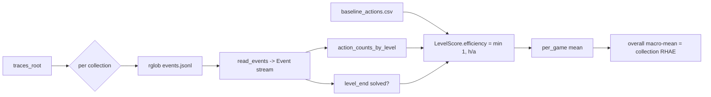

# Evaluation: the ARC-AGI-3 environment and the RHAE metric

This document describes what the Schema harness is evaluated *on* (the ARC-AGI-3
environment) and *by* (the RHAE metric), and how this reproduction validates its
scoring against the published traces without ever running a live game.

Two things are kept strictly separate throughout:

- **Published fact** — stated in the ARC-AGI-3 technical report, the ARC-AGI-3
  SDK/docs, the Schema project page, arXiv 2605.05138, or the dataset card.
- **Reconstruction** — a design decision made in *this* repo to satisfy the
  published behaviour where the exact original is not public. These are labelled
  "reconstructed", "inferred", or "not public".

See `docs/REPRODUCTION_PLAN.md` for the full known/inferred/impossible split.

---

## 1. The ARC-AGI-3 environment

ARC-AGI-3 is an **interactive POMDP**. The agent is dropped into a novel game
with **no instructions**: no object list, no rule sheet, no stated goal, and no
shaped reward. It must infer the mechanics of the world purely by acting and
observing. This is the whole point of the benchmark, and it is why the Schema
harness treats each game as an object of empirical study — writing and editing an
executable program that *is* the game's mechanism (see `docs/ARCHITECTURE.md`).

### 1.1 Per-step observation

At each step the environment returns a frame. Its fields, as modelled in
`schema_repro/types.py` (`Frame` dataclass) from the ARC-AGI-3 docs and SDK:

| Field | Type | Meaning |
| --- | --- | --- |
| `game_id` | `str` | Which game this frame belongs to. |
| `frame` | 3D list (`list[Grid]`) | A **stack** of 2D grids. |
| `grid` | 2D list | The top grid of the stack, kept for convenience (`Grid = list[list[int]]`). |
| `state` | `GameState` | Lifecycle state (see below). |
| `score` | `int`, `0..254` | The game's own score signal. |
| `available_actions` | `list[str]` | The **legal actions** at this step. |
| `level` | `int` | Current level index within the game. |

Each grid is **64x64** cells, and every cell is a **colour index in `0..15`**
(16 colours). The raw observation is therefore just a stack of colour-index
grids — there is no symbolic scene description. Turning that raw grid into
objects, variables, and relations is the harness's *state grounding* problem
(`Phase.GROUND` in `schema_repro/types.py`).

### 1.2 Actions

There are seven standardized actions, defined in `schema_repro/types.py`:

- `RESET` — restart a level.
- `ACTION1`..`ACTION5` — **simple** actions (for example up/down/left/right/enter;
  the concrete meaning per game is *not* given and must be discovered).
- `ACTION6` — a **complex** action that carries `{x, y}` coordinates.

The `Action` dataclass enforces this: an unknown action name raises, and
`ACTION6` requires `x` and `y` in its `data` payload — for example
`Action("ACTION6", {"x": 32, "y": 32})`. `SIMPLE_ACTIONS` and `ALL_ACTIONS`
enumerate the two groups. Which actions are legal at a given step is decided by
the environment and delivered in `available_actions`.

### 1.3 Game/level lifecycle

`GameState` (`schema_repro/types.py`) mirrors the ARC-AGI-3 SDK's four states:

| State | Meaning |
| --- | --- |
| `NOT_PLAYED` | The game/level has not been started. |
| `NOT_FINISHED` | In progress. |
| `WIN` | The level was completed. |
| `GAME_OVER` | The attempt ended without winning. |

### 1.4 Games and levels

The benchmark comprises **6 games** total: **3 public** (dev) and **3 private**
(leaderboard). Each game has **8-10 levels**. The public games are what a
reproduction can exercise directly; the private games back the leaderboard.

### 1.5 Live adapter

`schema_repro/env/arc_agi3.py` (`ArcAgi3Env`) is the best-effort adapter to the
real environment. Notable properties:

- The `arc-agi-3` client is imported **lazily** (`_client_or_init`), so nothing
  in the offline path or the test suite depends on the SDK being installed.
- `reset(game_id)` and `step(action)` call the client and normalize its result
  through `_to_frame`, which reads the raw object **defensively** (dict-or-object
  access) and maps it onto the `Frame` dataclass: it takes `frame[0]` as `grid`,
  coerces `state` into `GameState`, and clamps missing fields to safe defaults.
- For `ACTION6` it forwards the `{x, y}` payload; other actions send no data.

The adapter's header states plainly that **the exact SDK surface is external and
may drift**, so the mapping is a documented reconstruction from the ARC-AGI-3
docs, not a byte-for-byte contract. RHAE is computed **offline from traces**, so
this adapter is only needed for live evaluation — never for the tests or for the
scoring-validation path below.

---

## 2. The RHAE metric

**RHAE** = **Relative Human Action Efficiency**.

### 2.1 Official definition (published)

RHAE compares an agent's **per-level action count** against a **first-exposure
human baseline** and aggregates across environments. **100%** means completing
**every level of every environment at or above human-baseline action
efficiency.** Actions are the efficiency axis / tiebreaker: the fewer actions
(relative to the human baseline) an agent needs to solve a level, the higher it
scores. This is the definition given in the ARC-AGI-3 material; the property that
100% = every level solved at-or-under the human action budget is what the
reconstruction below must satisfy.

### 2.2 This repo's reconstruction of the formula

The **exact clipping and aggregation** used by the official scorer is **not fully
specified in public material.** `schema_repro/scoring/rhae.py` therefore
implements a documented reconstruction that satisfies the stated properties. It
is explicitly labelled as such in the module docstring.

The reconstructed formula:

- **Per level.** If the agent did **not solve** the level (or recorded a
  non-positive action count) → efficiency **0**. Otherwise, with `a` agent
  actions against human baseline `h`:

  ```
  efficiency = min(1, h / a)
  ```

  Using at most the human budget scores **100%**; using more scores
  proportionally less. This is `LevelScore.efficiency`.

- **Per game (environment).** The **mean** of that game's per-level
  efficiencies (`RhaeReport.per_game`).

- **Overall.** The **macro-average** across games/collections — the mean of the
  per-game means (`RhaeReport.overall`), so every environment carries equal
  weight regardless of its level count.

> **Flagged as reconstruction, not fact.** The `min(1, h/a)` clipping, the choice
> to zero unsolved levels, and the two-stage per-game-then-macro aggregation are
> this repo's inference of a scorer consistent with the published definition. The
> official implementation's exact clipping/aggregation is **not public**. Treat
> the formula as a faithful stand-in, not the original.

### 2.3 How action counts and "solved" are derived

RHAE is computed entirely from the streamed event log, not from live play:

- `schema_repro/tracing.py::action_counts_by_level` counts one action per
  `type == "action"` event, keyed by `(game_id, level)`. This is the bridge to
  the metric — the per-level action count the formula divides into.
- A level is **solved** when a `type == "level_end"` event carries
  `payload["solved"] == True` (`rhae.py::_solved_levels`).
- Human baselines come from a shared `baseline_actions.csv` with columns
  `game_id, level, baseline_actions` (`rhae.py::load_baselines`).

The event vocabulary and field names are themselves a **compatible
reconstruction** — the dataset's exact `events.jsonl` field names are not public.
See `docs/TRACE_FORMAT.md`.

---

## 3. Headline results (published)

From the fact sheet / announcement, on the **ARC-AGI-3 Public set**:

| Model configuration | RHAE |
| --- | --- |
| Claude **Opus 4.8 + Fable 5** (Anthropic) | **~99%** (self-reported 98.98%) |
| **GPT-5.6 Sol** (OpenAI) | **95.35%** |

The harness is **model-agnostic**: it changes the process around the model, not
the weights. These numbers belong to the original Schema harness. **This
reproduction does not claim any ARC-AGI-3 score.** It reproduces the *structure*
and *validates the scoring path*, and runs a toy game offline (Section 5).

---

## 4. Offline validation: recomputing RHAE from traces

The published dataset (`schema-harness/arc-agi-3-schema-traces`) ships enough to
**recompute every RHAE score** — this is the "impossible research" posture:
you can see and re-derive the structure even though byte-exact reproduction is
impossible. This repo mirrors that recompute workflow so the scoring path can be
validated end to end.

### 4.1 The recompute pipeline

`scripts/recompute_rhae.py` mirrors the dataset's recompute command:

```
python scripts/recompute_rhae.py <traces_root> [--baseline baseline_actions.csv]
```

It treats the immediate subdirectories of `<traces_root>` as **collections**
(for example `gpt_5_6_sol/` and `claude_fable_opus/`), scored separately. For
each collection it calls `recompute_from_traces`, which:

1. discovers every `events.jsonl` under the collection (`Path.rglob`),
2. streams each one (`read_events`),
3. reconstructs per-level action counts (`action_counts_by_level`),
4. joins the shared `baseline_actions.csv`, and
5. recomputes every `LevelScore`.

It then prints a per-level table followed by a per-collection RHAE summary. If
`--baseline` is omitted, `<traces_root>/baseline_actions.csv` is used.



### 4.2 The fixtures are illustrative, not real results

`fixtures/traces/` contains **synthetic, dataset-shaped** traces (generated by
`scripts/make_fixtures.py`), laid out like the real dataset:

```
fixtures/traces/
  baseline_actions.csv          # shared human baselines
  claude_fable_opus/            # collection
    ft09/  ls20/                # per-game trajectory dirs
  gpt_5_6_sol/
    ft09/  ls20/
```

Running the recompute over these fixtures exercises the full scoring path and
prints a table like:

```
collection          game       lvl   agent    base  solved    eff%
------------------------------------------------------------------
claude_fable_opus   ft09         0       7       8    True  100.0
claude_fable_opus   ft09         1      12      12    True  100.0
claude_fable_opus   ls20         0       8      10    True  100.0
claude_fable_opus   ls20         1      12      14    True  100.0
gpt_5_6_sol         ft09         0       8       8    True  100.0
gpt_5_6_sol         ft09         1      30      12   False    0.0
gpt_5_6_sol         ls20         0       9      10    True  100.0
gpt_5_6_sol         ls20         1      20      14    True   70.0
------------------------------------------------------------------
RHAE by collection:
  claude_fable_opus       100.00%
  gpt_5_6_sol              67.50%
```

> **These numbers are illustrative only.** The fixture game IDs (`ft09`, `ls20`),
> the two-level-per-game layout, the action counts, and the baselines are
> synthetic values chosen to demonstrate the formula's behaviour (a perfect
> collection; an under-budget win clipped to 100%; an over-budget win scoring
> `14/20 = 70%`; an unsolved level scoring 0%). They are **not** the real games,
> the real 8-10 levels per game, or the published ~99% / 95.35% results. They
> exist to validate that the reconstructed scorer *works*, not to reproduce any
> score. The corresponding tests live in `tests/` (RHAE math among the 13
> passing tests).

### 4.3 Validating against the *published* traces

Because `read_events` accepts any JSONL matching the reconstructed schema, the
same command can be pointed at a locally downloaded copy of the real dataset:

```
python scripts/recompute_rhae.py /path/to/arc-agi-3-schema-traces
```

To the extent the published field names line up with `docs/TRACE_FORMAT.md`, this
recomputes the dataset's own RHAE from its 50 `events.jsonl` logs. Where field
names differ (they are not public), the schema mapping in `tracing.py` is the one
place to adjust.

---

## 5. What this repo actually demonstrates

- **Structure**, not score: the phase cycle, verifiers, planner, and provider
  abstraction (see `docs/ARCHITECTURE.md`).
- **A validated scoring path**: RHAE recomputed from an event stream, with a
  reconstruction of the formula that is honest about its unknowns.
- **An offline toy game**: `scripts/run_offline_demo.py` drives the full loop over
  `schema_repro/env/simulated.py` (GridPursuit) with the deterministic
  `FakeProvider`, writing a real trace that the recompute path can score.
- **A live path that is available but not exercised here**:
  `schema_repro/env/arc_agi3.py` for real ARC-AGI-3 runs.

This repo does **not** claim an ARC-AGI-3 result. It reproduces the conceptual
structure of the Schema harness and validates the scoring against the published
traces.

---

## Sources

- https://schema-harness.github.io
- https://arxiv.org/abs/2605.05138
- https://huggingface.co/datasets/schema-harness/arc-agi-3-schema-traces
- https://arcprize.org
