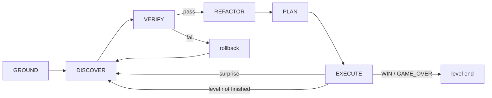

# Reproduction Plan

This is the central document of the repository. It answers one question directly:
**what can and cannot be reproduced from the published Schema material, and how
does this repo handle each gap honestly?**

## The "impossible research" framing

Impossible Research published the Schema harness as *reproducible enough to trust,
not reproducible enough to copy*. The [`arc-agi-3-schema-traces`](https://huggingface.co/datasets/schema-harness/arc-agi-3-schema-traces)
dataset ships 50 `events.jsonl` streams across two collections
(`gpt_5_6_sol/` and `claude_fable_opus/`) plus a shared `baseline_actions.csv`.
From those traces you can:

- **recompute RHAE** — stream the events, reconstruct per-level action counts,
  join the human baselines, and re-derive every score; and
- **see the structure** — the run/level/action/observation/model-edit/verify/plan
  event vocabulary exposes the agentic loop (ground → discover → verify → refactor
  → plan → execute) at trace granularity.

What the traces do **not** let you do is *byte-reproduce a run*. The prompts are
described but unreleased, the models are proprietary and drifting, the safety
fallback runs inside a vendor API, the sandbox limits are shape-only, the eval
infrastructure is internal, and model sampling is non-deterministic by nature.

So the honest posture of this repository is:

> Reproduce the **conceptual structure** faithfully, substitute a clean
> model-provider abstraction for the parts we cannot see, **document every gap**
> as known / inferred / impossible, and **validate** by recomputing RHAE against
> the published traces and checking structural parity — never by claiming a score.

This repo does **not** claim any ARC-AGI-3 result. It reproduces the harness
design, validates the *scoring*, and runs a toy game (`schema_repro/env/simulated.py`,
GridPursuit) offline. The published numbers — ~99% RHAE (self-reported 98.98%)
with Opus 4.8 + Fable 5, and 95.35% with GPT-5.6 Sol — are facts *about the
original*, not about anything produced here. The RHAE numbers printed by this
repo's fixtures are illustrative synthetic values; see `fixtures/traces/` and
`scripts/make_fixtures.py`.

## The six gaps

Each subsection states: what is **known** from public sources, what is **inferred**,
**why** byte-exact reproduction is impossible, **how** this repo approximates it
(pointing at a concrete module/config), and **how** the approximation is
**validated**.

| # | Gap | Known | This repo's substitute | Validation |
|---|-----|-------|------------------------|------------|
| 1 | System prompts & agent configs | Behaviour described; code "released after acceptance" | `schema_repro/agent.py`, phase/effort split in `configs/models.yaml` | Structure parity + same prompts across games |
| 2 | Exact model & API versions | Model *families* named; versions drift | Env-overridable IDs in `configs/models.yaml` + `schema_repro/providers/*` | Model-agnostic recompute; two profiles |
| 3 | Fable-5 fallback logic | Provider-internal server-side refusal fallback | Enabled (not re-implemented) in `anthropic_provider.py`; shape in `providers/base.py` | `RefusingProvider` fallback test |
| 4 | Sandbox / time / token / tool config | Shape described; limits not | `configs/default.yaml` + `schema_repro/sandbox.py` | Sandbox allowlist tests; documented as tunable |
| 5 | Internal infrastructure | Eval infra not published | Injectable `Environment`/`Provider` seams in `controller.py` | Offline replay + recompute reproduce dataset workflow |
| 6 | Non-deterministic responses | Sampling is stochastic | `FakeProvider` for determinism | Determinism only via the fake path |

### 1. The concrete system prompts and agent configurations

**Known.** The Schema project page and the arXiv report (2605.05138) describe the
*behaviour* the prompts induce: the model plays each game "like a physicist",
authoring and continually editing a single small Python program that jointly
solves state grounding (64×64 grid of 16 colour indices → objects/variables/
relations) and mechanism discovery (how state changes under an action), refactors
it toward simpler abstractions as an MDL-like simplicity proxy, and only commits
live actions after formal verifiers pass. Crucially, the **same agent and prompts
are used across all games** — no game-specific text. The authors state the project
code will be released after acceptance.

**Inferred.** The exact wording, ordering, few-shot content, and tool-call schema
of the system prompts. This repo reconstructs the *roles* those prompts play as
distinct agent methods (`revise_world_model`, `explore` in `schema_repro/agent.py`,
declared as the `Agent` protocol in `schema_repro/controller.py`) and as a fixed
tool surface (`configs/default.yaml` `tools:` — `edit_world_model`, `run_verifier`,
`run_planner`, `submit_actions`, `observe`). The per-phase reasoning-effort split
(`configs/models.yaml` `effort_by_phase`) is inferred from public guidance:
`ground:high, discover:xhigh, verify:xhigh, refactor:high, plan:xhigh, execute:high`.

**Why impossible.** Unreleased text cannot be byte-reproduced; any wording here is
our own clean-room phrasing.

**How approximated.** The prompt *contract* is encoded structurally: the phase
cycle in `schema_repro/types.py` (`Phase`), the game-agnostic loop in
`schema_repro/controller.py`, and the effort map consumed via
`RunConfig.effort(phase)` in `schema_repro/config.py`. No game-specific code or
prompt lives in the harness — everything game-specific is confined to the agent's
editable program, exactly as described.

**How validated.** Two invariants a faithful rebuild must satisfy: (a) the phase
transitions observed in the published `events.jsonl` match the loop this repo
drives; (b) **the same prompts/config are used for every game** — verifiable
because the controller and agent take no `game_id`-conditioned branch.

### 2. Exact model and API versions

**Known.** The model *families*: Anthropic Opus 4.8 + Fable 5, and OpenAI
GPT-5.6 Sol. The harness is **model-agnostic** — the same process reached ~99%
and 95.35% with those two stacks. Current Anthropic API facts this repo keeps
correct (`schema_repro/providers/anthropic_provider.py`): Opus 4.8 and Fable 5
reject `budget_tokens` and `temperature`/`top_p`/`top_k` (HTTP 400); Opus 4.8 uses
`thinking={"type":"adaptive"}`; Fable 5's thinking is always on (the parameter is
omitted); depth is controlled by `output_config.effort ∈ {low,medium,high,xhigh,max}`.

**Inferred.** The exact dated snapshots Impossible Research called. These are
deliberately **not** hard-coded — `configs/models.yaml` uses `model_default` with
`model_env` overrides (`ANTHROPIC_DEFAULT_FABLE_MODEL`, `ANTHROPIC_DEFAULT_OPUS_MODEL`,
`OPENAI_DEFAULT_MODEL`) resolved by `_resolve_stage` in `schema_repro/config.py`.

**Why impossible.** Frontier, proprietary models drift and deprecate; there is no
stable artifact to pin to, and the original snapshot is not stated.

**How approximated.** All model access sits behind the `Provider` protocol
(`schema_repro/providers/base.py`). Concrete providers
(`anthropic_provider.py`, `openai_provider.py`) map the abstract `ModelRequest`
(system, messages, `Effort`, `max_tokens`) onto each vendor API; the `Effort` enum
(`schema_repro/types.py`) lines up 1:1 with `output_config.effort`. Note the enum
stops at `XHIGH`; the API's `max` tier exists but is not used by the reconstructed
`effort_by_phase`.

**How validated.** Because scoring is model-agnostic, RHAE recompute
(`schema_repro/scoring/rhae.py`) is independent of which model produced a trace —
the two published collections are scored by the *same* code. A rebuild swapping
model IDs must still recompute the same per-level table from a given trace.

### 3. Fable-5 fallback logic

**Known.** This is the Anthropic **server-side refusal fallback**: a Fable 5
request that the safety classifiers decline returns HTTP 200 with
`stop_reason:"refusal"`, and is re-served by Opus 4.8 *inside the same call* via
`betas=["server-side-fallback-2026-06-01"]` + `fallbacks=[{"model":"claude-opus-4-8"}]`.
The mechanism is **provider-internal** — a two-stage classifier a reproduction can
*enable* but cannot re-implement.

**Inferred.** Nothing about the classifier's decision boundary is public; this repo
does not model it.

**Why impossible.** The refusal decision and the hand-off both execute inside
Anthropic's API; an external harness has no access to the classifier.

**How approximated.** Two layers, kept distinct:

1. *Enable the real thing.* `AnthropicProvider` (`anthropic_provider.py`) sets the
   beta + `fallbacks` params when the primary is an always-thinking model (Fable 5 /
   Mythos 5) and routes through `client.beta.messages`. This turns on the genuine
   server-side fallback; it does not simulate it.
2. *Model the contract, not the internals.* `FallbackProvider`
   (`providers/base.py`) reproduces the *shape* — an ordered, primary-first chain
   with a configurable trigger predicate (`refused_or_errored` advances on any
   error or `stop_reason=="refusal"`). `configs/models.yaml` sets the anthropic
   profile's `fallback_on: [refusal, error, timeout]`. To avoid stacking the two,
   `registry.py` enables the server-side fallback **only** for a single-stage
   always-thinking profile and disables it when a profile already chains to a
   second model (the client-side `FallbackProvider` handles that case).

**How validated.** `RefusingProvider` (`providers/fake.py`) always returns a
refusal; a test drives it through `FallbackProvider` to confirm the chain advances
to the next provider. This validates the *contract shape*, explicitly not the
proprietary classifier.

**Deep dive:** [`docs/MODEL_AND_FALLBACK.md`](MODEL_AND_FALLBACK.md) covers the full
model layer, the exact API params, and the single- vs multi-stage fallback wiring.

### 4. Sandbox, time, token, and tool configuration

**Known.** The *shape*: the agent's world model is a small Python program executed
in isolation, checked before any live action is committed; planning/verification
receive more reasoning compute than execution; the tool surface is minimal and
game-agnostic.

**Inferred.** Every concrete limit. `configs/default.yaml` says so in its header
and treats each number as a tunable starting point: `sandbox` (subprocess backend,
`network:false`, `wall_clock_s:5`, `memory_mb:512`, `cpu_seconds:5`, an
`allowed_imports` allowlist) and `budgets` (`max_live_actions_per_level:300`,
`max_model_edits_per_level:40`, `max_plan_depth:64`, `max_plan_nodes:200000`,
`token_budget_per_level:2000000`, `verify_min_transitions:1`).

**Why impossible.** The paper describes the budget's *shape* but publishes no exact
limits; the original numbers are not stated.

**How approximated.** `schema_repro/sandbox.py` loads the untrusted agent program
with an import allowlist (`_guarded_import`) and injects the `Action`/`Frame`
contract so the program can emit real actions without importing (and thus reaching)
the harness. It documents that a real deployment would fork into a container/
namespace with seccomp and CPU/memory/wall-clock rlimits — the reconstruction
implements the *isolation shape*, not production hardening. Budgets are read once
by `schema_repro/config.py` and enforced in the loop (`controller.py` checks
`max_live_actions_per_level`, `max_model_edits_per_level`, `max_plan_depth`).

**How validated.** Sandbox tests exercise the import allowlist (permitted imports
load; disallowed imports raise `SandboxError`). The limits themselves are validated
only as *plumbing that reads the config* — their numeric fidelity to the original
is explicitly unclaimed.

**Deep dive:** [`docs/SANDBOX_AND_BUDGETS.md`](SANDBOX_AND_BUDGETS.md) details the
two sandbox backends, every budget knob, and the minimal tool surface.

### 5. Possibly internal infrastructure

**Known.** The dataset's recompute workflow (stream events → reconstruct per-level
action counts → recompute RHAE → print a table + summary) and the per-trajectory
layout (`run.json`, `events.jsonl`, sanitized session data, snapshots, shareable
files). The eval infrastructure that *produced* the runs (Impossible Research's
internal harness orchestration, queuing, storage) is not published.

**Inferred.** Everything about that internal infra. This repo does not reconstruct
it; it reconstructs the *observable artifacts and the recompute path*.

**Why impossible.** Internal tooling was never released.

**How approximated.** The controller depends only on injected seams —
`Environment` and `Provider` protocols (`controller.py`, `providers/base.py`) — so
the same loop runs against a live game (`schema_repro/env/arc_agi3.py`), a toy game
(`env/simulated.py`), or a recorded trace (`env/replay.py`). The dataset workflow
is reproduced by `schema_repro/scoring/rhae.py::recompute_from_traces` and the
`scripts/recompute_rhae.py` CLI (discover collections, score each, print per-level
table + per-collection RHAE), and the trace schema is reconstructed in
`schema_repro/tracing.py`. Because exact `events.jsonl` field names are not public,
the schema is *compatible*, not identical — stated in `tracing.py` and
`docs/TRACE_FORMAT.md`.

**How validated.** Running `scripts/recompute_rhae.py` over the published traces
must reproduce the dataset's own table — this is the load-bearing external check
that our reconstruction of the workflow is correct even though the infra is not.

### 6. The same non-deterministic model responses

**Known.** The models are sampled; identical inputs do not yield identical outputs.

**Inferred.** Nothing to infer — this is a property, not a hidden detail.

**Why impossible.** Non-determinism is intrinsic to sampling from a frontier model;
no external harness can reproduce a specific realized completion.

**How approximated.** We do **not** try to reproduce specific completions. Where
determinism is needed — tests, end-to-end plumbing checks, trace replay — the
`FakeProvider` (`providers/fake.py`) returns canned or scripted responses (e.g. a
queued sequence of world-model edits) with no network. This isolates *harness
correctness* from *model stochasticity*: the loop, verifier gating, planner, and
tracing are all exercised deterministically.

**How validated.** Determinism claims in this repo hold **only** on the
`FakeProvider` path (the `fake` profile in `configs/models.yaml`). End-to-end tests
run the full controller with scripted fake responses so outcomes are reproducible;
no test asserts determinism over a live model.

## How to know your rebuild is faithful

A faithful rebuild is not one that reproduces a run — that is impossible. It is one
that passes these structural and scoring checks:

- [ ] **Structure parity.** The control loop is the fixed Schema cycle
      `GROUND → DISCOVER → VERIFY → REFACTOR → PLAN → EXECUTE`, with a *surprise*
      (a live frame disagreeing with the model's prediction) routing control back
      to discovery. Compare against `schema_repro/controller.py` and the `Phase`
      enum, and against the phase transitions visible in the published
      `events.jsonl`.

- [ ] **Verifier gating.** No live action is committed until *both* verifiers pass:
      the world-model verifier (the program must reproduce recorded observations)
      and the planner verifier (a bounded search must reach a goal *inside* the
      model). See `schema_repro/verifier.py` (`check_world_model`, `check_planner`)
      and the gate in `controller.py::run_level`.
- [ ] **RHAE recompute matches the published table.** Running
      `scripts/recompute_rhae.py <traces_root>` over the published dataset must
      reproduce the dataset's per-level table and per-collection RHAE. This is the
      single most important external check; the scoring is model-agnostic
      (`schema_repro/scoring/rhae.py`).
- [ ] **Same prompts/config across games.** The agent and its prompts carry no
      game-specific branch; the harness contains no game-specific code, heuristics,
      or hidden solutions. Everything game-specific lives only in the agent's
      editable program.
- [ ] **Single editable program.** State grounding and mechanism discovery are
      solved *jointly* in one small Python program with the fixed
      `ground`/`step`/`is_goal`/`render`/`actions` interface (`schema_repro/world_model.py`,
      loaded by `schema_repro/sandbox.py`), refactored toward simpler abstractions
      as an MDL-like proxy.
- [ ] **Model-agnostic seam.** All model access is behind the `Provider` protocol,
      with the fallback modelled as a configurable chain — enabling the real
      server-side Fable-5 fallback where available, and never claiming to
      re-implement it.
- [ ] **Determinism only via the fake path.** Reproducible end-to-end runs exist
      only through `FakeProvider`; no claim of determinism is made over live,
      sampled models.

## Sources

- https://schema-harness.github.io
- https://arxiv.org/abs/2605.05138
- https://huggingface.co/datasets/schema-harness/arc-agi-3-schema-traces
- https://arcprize.org
