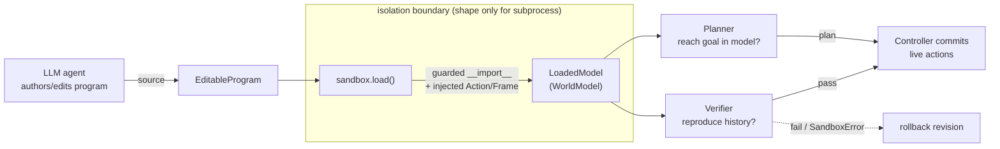

# Sandbox, Time, Token, and Tool Configuration (reconstruction)

This document covers **item (4)** of the "impossible to byte-reproduce" list from
[`docs/REPRODUCTION_PLAN.md`](REPRODUCTION_PLAN.md): the sandbox, time, token, and
tool configuration around the agent.

> **Every number in this document is a tunable reconstruction, not a published
> value.** The Schema paper and project page describe the *shape* of the budget —
> the agent's world model is a small Python program that is checked before it is
> allowed to drive live actions; planning and verification get more reasoning
> compute than execution — but they do not release concrete sandbox limits, token
> caps, or tool schemas. Impossible Research states that project code is "released
> after acceptance." Until then the exact limits are **not public**, and the
> values in [`configs/default.yaml`](../configs/default.yaml) are a starting point
> chosen to be self-consistent, not a claim about the original run.

---

## 1. Why the agent-authored world model is untrusted code

The central move in Schema is that the frontier model does not *play* the game. It
**writes and continually edits a single small Python program** that jointly solves
state grounding and mechanism discovery, and the harness then executes that program
to ground frames, predict transitions, verify against history, and plan
([`schema_repro/world_model.py`](../schema_repro/world_model.py) defines the
interface the program must satisfy: `ground`, `step`, `is_goal`, `render`,
`actions`).

That program is **model-generated source that the harness runs**. It is untrusted
for two independent reasons:

1. **Safety / isolation.** Executing model-authored code in-process gives it the
   same reach as the harness — file system, network, the harness package itself.
   A world model must never be able to reach the ARC-AGI-3 API directly, exfiltrate
   data, or interfere with the run.
2. **Liveness.** The program is called in tight loops by the verifier and the
   planner (`render(step(ground(frame), action))` per recorded transition; a
   bounded search over `actions`/`step`/`is_goal`). A buggy or adversarial program
   can loop forever, allocate unbounded memory, or recurse without limit. Every
   invocation therefore needs a wall-clock, CPU, and memory ceiling so one bad
   revision cannot stall or crash the run.

Because the program is untrusted, the harness talks to it **only through the fixed
`WorldModel` interface** and passes it a minimal contract (the `Action` and `Frame`
types) rather than letting it import the harness. This is also what keeps the
harness game-agnostic: all game understanding lives *inside* the program the model
writes, never in the harness or the tools.

---

## 2. Sandbox backends

[`schema_repro/sandbox.py`](../schema_repro/sandbox.py) defines the isolation
boundary. It exposes one `load(program, sandbox)` entry point that compiles the
program source and returns a `LoadedModel` — a `WorldModel`-conforming handle whose
`ground`/`step`/`is_goal`/`render`/`actions` methods call into the program's
namespace.

Two backends are named by `SandboxConfig.backend`
([`schema_repro/config.py`](../schema_repro/config.py)):

| Backend | What it is | Status in this repo |
|---|---|---|
| `none` | In-process `exec` with an **import allowlist**. Fast; used by the tests. Suitable only when the program is trusted. | Implemented. |
| `subprocess` | Re-exec the program in a child process with CPU / memory / wall-clock `rlimits` and no inherited file descriptors. This is the **shape** of the real sandbox. | Shape reconstructed; see the honesty note below. |

### 2.1 The in-process loader (implemented)

`load()` builds a fresh namespace, installs a **guarded `__import__`** that rejects
any import whose root module is not in `sandbox.allowed_imports`, injects `Action`
and `Frame` so the program can emit real actions without importing the harness, and
then `compile`/`exec`s the source. Any failure to load — including a blocked import —
is surfaced as `SandboxError`, which the verifier and planner treat as a
verification failure rather than a crash
([`schema_repro/verifier.py`](../schema_repro/verifier.py),
[`schema_repro/planner.py`](../schema_repro/planner.py) both catch `SandboxError`
and return "no", i.e. an unverifiable model / empty plan).

### 2.2 Honesty note: what is and isn't enforced today

Read [`schema_repro/sandbox.py`](../schema_repro/sandbox.py) carefully before
relying on it:

- The **import allowlist is really enforced**, in both `none` and `subprocess`
  modes. `load()` deliberately keeps the guard active regardless of backend so the
  tests exercise the restriction.
- The **`subprocess` backend does not currently fork.** The loader comment is
  explicit: *"The `subprocess` backend is intentionally routed through the same
  in-process loader here with the import allowlist enforced; a real deployment
  would fork."* So the `wall_clock_s`, `memory_mb`, and `cpu_seconds` knobs
  describe the **intended shape** of the child-process limits; they are read into
  `SandboxConfig` but **not applied** by the current in-process loader.
- The `none` backend is **not a security boundary.** The guarded `__import__` only
  gates imports; the namespace still receives a full copy of `builtins`. An import
  allowlist stops a program from pulling in `socket` or `subprocess`, but it is not
  a substitute for OS-level isolation. Treat `none` as "for trusted code and
  tests," exactly as the module docstring says.

To make `subprocess` real you would fork a child, `os.setrlimit` CPU
(`RLIMIT_CPU`), address space (`RLIMIT_AS`), and file size, arm a wall-clock alarm,
close inherited descriptors, and serialise `State` across the boundary (which
constrains the program's state to something picklable/JSON-able — the harness
already treats `State` as opaque and JSON-serialisable in
[`world_model.py`](../schema_repro/world_model.py)).

### 2.3 Production hardening is out of scope (documented, not implemented)

A production deployment of this design would run the child in a
container/namespace with seccomp (no network namespace, read-only rootfs, syscall
allowlist, dropped capabilities). That is **out of scope for a reproduction
scaffold and is documented rather than implemented**, per the module docstring.
The point of this repo is to reproduce the *structure* — untrusted program behind a
fixed interface, gated by verifiers, bounded by budgets — not to ship a hardened
runtime.

---

## 3. Sandbox config knobs

From the `sandbox:` block of [`configs/default.yaml`](../configs/default.yaml),
loaded into `SandboxConfig`:

| Key | Default | Meaning | Reconstruction status |
|---|---|---|---|
| `backend` | `subprocess` | `subprocess` \| `none` | shape / knob |
| `network` | `false` | Deny network from the sandbox. Declarative; the in-process loader has no network to grant, a real subprocess would enforce it. | inferred (Schema states no network reach) |
| `wall_clock_s` | `5` | Per world-model / planner invocation. **Not enforced by the current loader.** | reconstructed number |
| `memory_mb` | `512` | Per-invocation memory cap. **Not enforced by the current loader.** | reconstructed number |
| `cpu_seconds` | `5` | Per-invocation CPU cap. **Not enforced by the current loader.** | reconstructed number |
| `allowed_imports` | `dataclasses, itertools, collections, heapq, math, typing` | Import allowlist. **Enforced.** | reconstructed list |

The allowlist is deliberately tiny: it is enough to write a clean state
representation and transition function (dataclasses, small containers, a priority
queue, arithmetic, type hints) and nothing that reaches out of process.

---

## 4. Budget knobs and how the controller enforces them

From the `budgets:` block of [`configs/default.yaml`](../configs/default.yaml),
loaded into `Budgets`. The enforcement points below are all in
[`schema_repro/controller.py`](../schema_repro/controller.py) `run_level(...)`
unless noted.

| Knob | Default | What it bounds | Where / how it is enforced |
|---|---|---|---|
| `max_live_actions_per_level` | `300` | Live actions committed to the game this level (bounds RHAE cost and prevents runaway play). | Loop guard `actions_used < b.max_live_actions_per_level` and an inner `break` after each committed action. |
| `max_model_edits_per_level` | `40` | Revisions of the world-model program. | Gate `edits < b.max_model_edits_per_level` before `agent.revise_world_model(...)`. |
| `verify_min_transitions` | `1` | Recorded transitions required before the model is edited/trusted. | Gate `len(history) >= b.verify_min_transitions` before revising. |
| `max_plan_depth` | `64` | Planner search horizon (steps). | Controller truncates the returned plan: `planner.plan(...)[: b.max_plan_depth]`. |
| `max_plan_nodes` | `200000` | Planner search-node cap. | See honesty note below. |
| `token_budget_per_level` | `2000000` | Summed model output tokens (soft cap). | See honesty note below. |

### 4.1 Enforcement flow

Per iteration of the level loop:

1. **Ground / discover.** If enough history exists and the edit budget is not
   exhausted, the agent revises the single editable program; `edits` is
   incremented and a `model_edit` event is emitted.
2. **Verify.** Both verifiers must pass (`check_world_model` *and*
   `check_planner`); otherwise the revision is rolled back
   (`program.rollback()`). Only a verified model is trusted.
3. **Plan or explore.** If `check_world_model` passes, the planner searches inside
   the model and the plan is capped to `max_plan_depth`; otherwise the agent
   proposes a single exploratory action.
4. **Execute.** Actions are committed one at a time; each increments
   `actions_used`, appends a `Transition`, and emits `action` / `observation`
   events. A **surprise** — the model's prediction disagreeing with the observed
   frame, checked via a one-item history in `_surprised(...)` — abandons the rest
   of the plan and re-opens discovery.

### 4.2 Honesty note: budgets declared but not yet wired

Two knobs exist in [`configs/default.yaml`](../configs/default.yaml) and `Budgets`
but are **not threaded into the running code** in the current scaffold:

- **`max_plan_nodes`** is a real cap, but it lives on the *planner*, not the
  controller. `BFSPlanner`
  ([`schema_repro/planner.py`](../schema_repro/planner.py)) enforces its own
  `max_nodes` (constructor default `200_000`) and `max_depth` (default `64`); the
  demo/test wiring constructs `BFSPlanner(cfg.sandbox)` with those defaults rather
  than passing `budgets.max_plan_nodes`. The numbers happen to match, but the
  budget value is **not** currently plumbed from `Budgets` into the planner.
  Likewise `SchemaVerifier`'s `plan_node_cap` (default `20_000`) and
  `plan_depth_cap` (default `64`) are separate constructor knobs.
- **`token_budget_per_level`** is declared as a soft cap but is **not consumed
  anywhere** in the controller, agent, or providers today. Wiring it up means
  summing `ModelResponse` output-token usage across a level and short-circuiting
  the loop when the cap is crossed. It is documented here so the gap is explicit
  rather than silent.

These gaps are called out on purpose: the reconstruction's honest posture is to
show the *knob* and the *intended enforcement point* even where the scaffold does
not yet enforce it.

---

## 5. The minimal fixed tool surface

The `tools:` block in [`configs/default.yaml`](../configs/default.yaml) declares a
small, fixed set of tools, loaded verbatim into `RunConfig.tools`:

| Tool | Description | Backing operation |
|---|---|---|
| `edit_world_model` | Replace or patch the single editable world-model program. | `agent.revise_world_model(...)` → `EditableProgram.edit/rollback` |
| `run_verifier` | Run the world-model + planner verifiers against recorded history. | `verifier.check_world_model` / `check_planner` |
| `run_planner` | Search inside the current world model for an action sequence to the goal. | `planner.plan(...)` |
| `submit_actions` | Commit a verified plan (or a single exploratory action) to the live game. | `env.step(...)` inside the execute phase |
| `observe` | Read the latest frame(s) and recorded transition history. | `env.reset` / frames + the `history` list of `Transition`s |

**Why the surface is this small.** The tools describe *process* operations only —
edit the model, check it, plan on it, act, observe. There is deliberately **no
game-specific tool**: no "move the player," no "count objects," no per-game
heuristic. Everything game-specific lives in the agent's editable program (the
`ground`/`step`/`is_goal`/`render`/`actions` functions), which is exactly what lets
the *same agent and the same tools* be used across every ARC-AGI-3 game. Adding a
game-aware tool would leak game knowledge into the harness and break that property.

**Honesty note on the tool surface.** In the current scaffold this list is
**declarative metadata** — a name + description contract that documents the five
operations — rather than a wired function-calling schema. The
[`LLMAgent`](../schema_repro/agent.py) drives the model with text prompts and
parses a fenced code block (for `edit_world_model`) or an action token (for
exploration); the controller invokes the verifier, planner, and environment
directly. A live provider integration could surface these five names as actual
tool/function definitions, but the reconstruction keeps the *contract* fixed and
small regardless of how it is presented to the model.

---

## 6. Reconstruction status summary

| Item | Status | Notes |
|---|---|---|
| Untrusted-program isolation as a design requirement | **known** | Directly implied by Schema running model-authored code. |
| Import allowlist mechanism | **implemented (reconstructed)** | The list of allowed modules is inferred. |
| `subprocess` rlimits (wall-clock/CPU/memory) | **shape reconstructed, not enforced** | Loader routes through the in-process path; numbers are placeholders. |
| Container / namespace / seccomp hardening | **out of scope, documented** | Not implemented by design. |
| `network: false` | **inferred** | Schema needs no network from the sandbox. |
| Budget knobs (`max_live_actions`, `max_model_edits`, `max_plan_depth`, `verify_min_transitions`) | **enforced (reconstructed numbers)** | Values are tunable, not published. |
| `max_plan_nodes`, `token_budget_per_level` | **declared, not yet wired** | Enforcement points documented in §4.2. |
| Five-tool surface | **reconstructed contract** | Names/descriptions inferred; currently declarative metadata. |

None of the numeric limits above are published by Impossible Research. They are a
self-consistent reconstruction intended to be edited.

---

## Sources

- https://schema-harness.github.io
- https://arxiv.org/abs/2605.05138
- https://arcprize.org (ARC-AGI-3 technical report)
- https://huggingface.co/datasets/schema-harness/arc-agi-3-schema-traces
- Repo modules referenced above:
  [`schema_repro/sandbox.py`](../schema_repro/sandbox.py),
  [`schema_repro/config.py`](../schema_repro/config.py),
  [`schema_repro/controller.py`](../schema_repro/controller.py),
  [`schema_repro/verifier.py`](../schema_repro/verifier.py),
  [`schema_repro/planner.py`](../schema_repro/planner.py),
  [`schema_repro/world_model.py`](../schema_repro/world_model.py),
  [`configs/default.yaml`](../configs/default.yaml)
